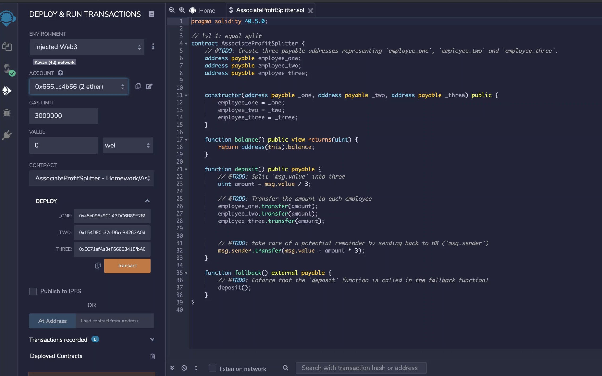

# Unit-20-Homework

Kovan Contract address:  0x5FcaB3dd37FA78d568C032eD62A558bdcb896cea

https://kovan.etherscan.io/address/0x5FcaB3dd37FA78d568C032eD62A558bdcb896cea

## Introduction
I completed 1 of the 3 contracts that were required for this assignment.  

### Contract #1 -- Association Profit Splitter
The contracts goal was to split profit equally between three different ethereum addresses.  This contract requires on deployment three different addresses.  A public function <i>deposit()</i> allows you to deposit ether and that amount is split equally between the three addresses.  Any remaining wei is returned back to the sender.  A fallback function allows for any funds to be returned back to sender as there is no withdrawal function.

See the attached screengrab and 
[screen recording here](https://drive.google.com/file/d/1cuRpEUQKA1-Ju-FDgxNKOVzQ0xjyYc6C/view?usp=sharing) illustrating the deployment and deposit functions showing 1 ether being deposited and equally distributed among the three addresses.

